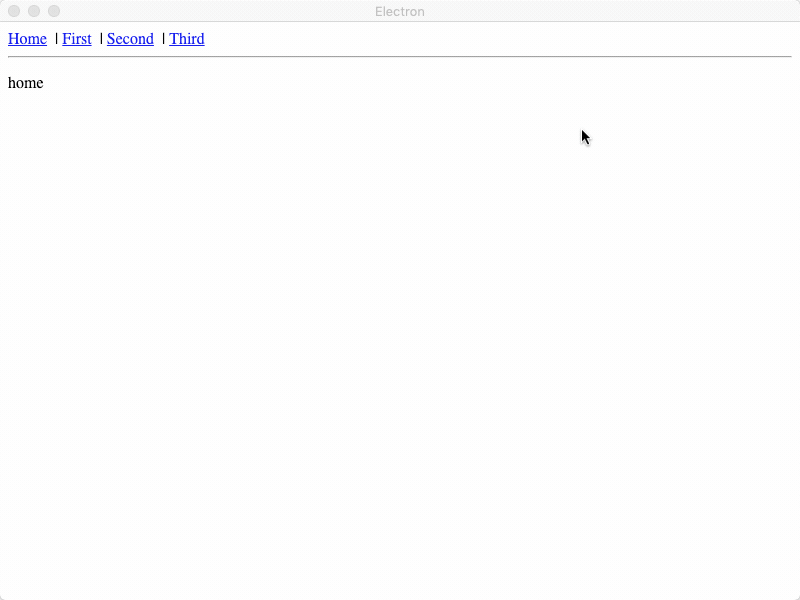
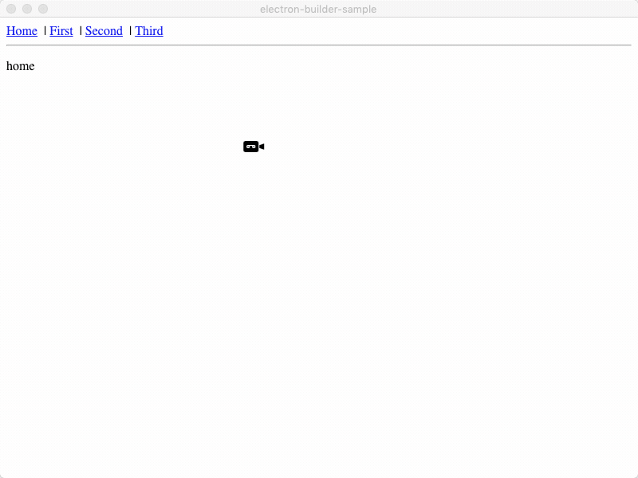
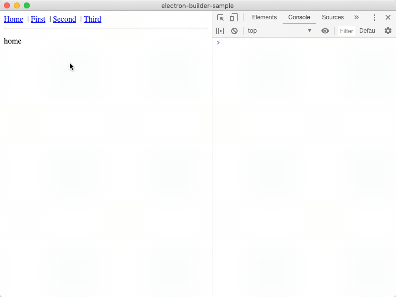

Minimal reproducible sample outlining issue with react-router-dom and Electron.

- HashRouter is used instead of BrowserRouter
- ```
  "electron": "^5.0.0",
  "electron-builder": "^20.39.0",
  "electron-webpack": "^2.6.2",
  "react-router-dom": "^5.0.0"
  ```

## Development

In development, everything works correctly. This is the expected behavior in production.



## Production

In production, routing is broken. There are no errors in the console.



This shows the devtools while in production. Upon clicking a NavLink for the page you are currently on,
a warning is logged. `Warning: Hash history cannot PUSH the same path; a new entry will not be added to the history stack`. This seems to indicate that the route changes but it does not render.

